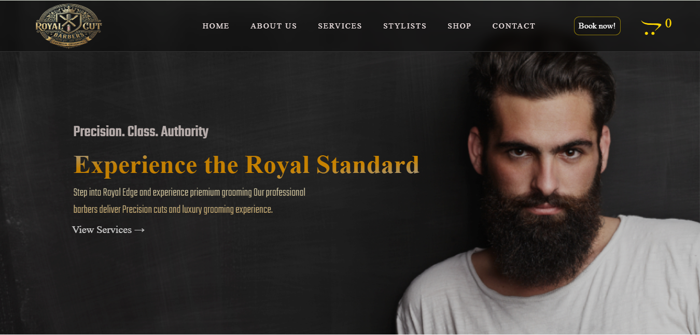

#  Royal Barbers

A modern and responsive barbershop website built with React. The application showcases barber services, pricing, gallery, and contact information with a clean and attractive user interface.

##  Live Demo

🔗 https://royal-barbers.vercel.app/

##  GitHub Repository

  https://github.com/vjnithish17/Royal-Barbers

##  Features

-  Modern Barbershop Landing Page
-  Services Section
-  Pricing Plans
-  Gallery
-  Customer Testimonials
-  Contact Information
-  Fully Responsive Design
-  Smooth Scrolling & Animations

##  Tech Stack

- HTML5
- CSS3
- Font Awesome

##  Screenshot



##  Installation

```bash
git clone https://github.com/vjnithish17/Royal-Barbers.git
cd Royal-Barbers
npm install
npm start
```

##  Deployment

**Frontend:** https://royal-barbers.vercel.app/

##  Author

**Nithish E**

-  Portfolio: https://nithish-plum.vercel.app/
-  GitHub: https://github.com/vjnithish17
-  LinkedIn: https://www.linkedin.com/in/nithish-e-27b2822a5/
-  Email: vjnithish17@gmail.com

---

 If you found this project useful, consider giving it a **Star** on GitHub.
